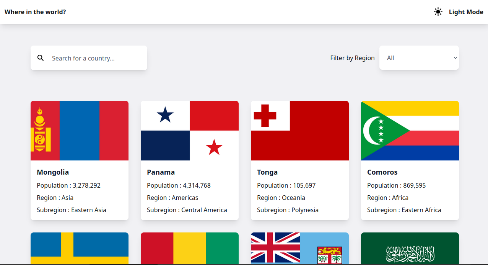

  

  <h2 align="center">REST Countries API with color theme switcher</h2>
	
  

	  
	
	
 

  
  

  

    <a href="https://www.frontendmentor.io/"><strong>Frontend Mentor Challenge</strong></a>
  

#

This is a solution to the [REST Countries API with color theme switcher challenge on Frontend Mentor](https://www.frontendmentor.io/challenges/rest-countries-api-with-color-theme-switcher-5cacc469fec04111f7b848ca). Frontend Mentor challenges help you improve your coding skills by building realistic projects.

 

<h2 align="center">Links</h2>

- Solution URL: [REST Countries API (Next.js + TypeScript + Tailwind) | Frontend Mentor](https://www.frontendmentor.io/solutions/countries-website-iGOcIZEc9v)
- Live Site URL: [https://countries-website-theta.vercel.app/](https://countries-website-theta.vercel.app/)

 

## Table of contents

- [Overview](#overview)
  - [The challenge](#the-challenge)
  - [Screenshot](#screenshot)
- [My process](#my-process)
  - [Built with](#built-with)
  - [What I learned](#what-i-learned)
  - [Useful resources](#useful-resources)
- [Author](#author)

 

## Overview

### 📝  The challenge

The challenge is integrating with the [REST Countries API](https://restcountries.com/) to pull country data and display it like in the designs.

Users should be able to:

- [x] See all countries from the API on the homepage
- [x] Search for a country using an `input` field
- [x] Filter countries by region
- [x] Click on a country to see more detailed information on a separate page
- [x] Click through to the border countries on the detail page
- [x] View the optimal layout for the interface depending on their device's screen size
- [x] See hover and focus states for all interactive elements on the page
- [x] **Bonus**: Toggle the color scheme between light and dark mode

 

### Screenshot

 

## My process
### Built with
- Next.js
- Tailwind CSS
- TypeScript
- Custom Hooks
- Semantic HTML5 markup

 

### What I learned
- Next.js
- Typescripts
- API integration
  
 
  
### Useful resources
- [Tailwind CSS](https://tailwindcss.com/)
- [Next.js Documentation](https://nextjs.org/docs) - learn about Next.js features and API.
- [Learn Next.js](https://nextjs.org/learn) - an interactive Next.js tutorial.

 

## Author
- Frontend Mentor - [@ny-aina-solofo](https://www.frontendmentor.io/profile/ny-aina-solofo)
- github : https://github.com/ny-aina-solofo
&nbsp;
